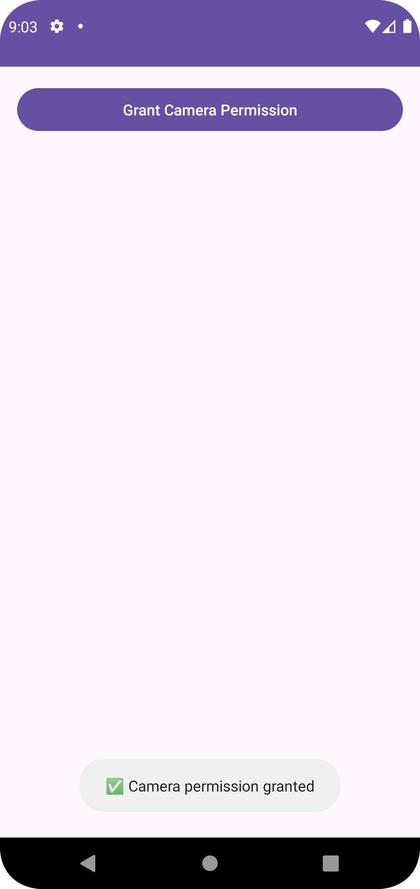
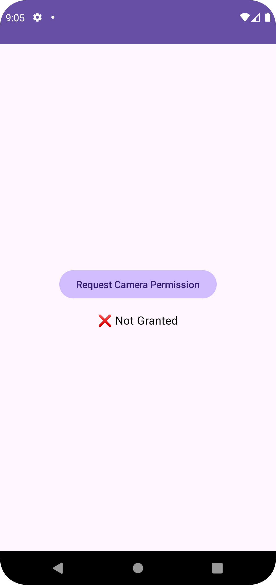
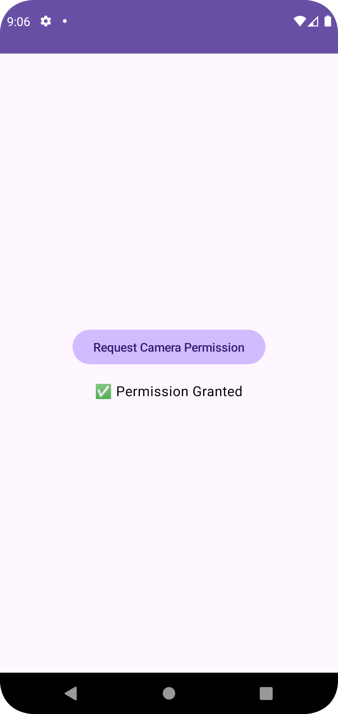

# AndroidPermissionsSample

This project demonstrates how to handle **runtime permissions in Android** using both **XML-based UI** and **Jetpack Compose**. It is designed for modern development standards with support for Kotlin, Material Design 3, and best practices for requesting and managing permissions in Android 13+.

---

## 🔧 Tech Stack

- **Kotlin** `1.9.24`
- **Jetpack Compose** `1.5.4`
- **Compose Compiler** `1.5.14`
- **Material 3 + Material Components**
- **AndroidX Activity / ConstraintLayout**
- **Gradle Version Catalog**
- **Minimum SDK**: 24
- **Target SDK**: 34

---

## 🧠 What’s Inside

| Feature | Details |
|--------|---------|
| `MainActivity.kt` | Home screen to choose XML or Compose-based permission handling |
| `XmlPermissionActivity.kt` | Traditional `View`-based runtime permission request (Camera) |
| `ComposePermissionActivity.kt` | Modern Compose-based permission request using `rememberLauncherForActivityResult` |
| `PermissionUtils.kt` | Shared utility class to check, request, and explain permissions |
| `AppTheme.kt` | Jetpack Compose Material 3 theming |
| `activity_main.xml` | ConstraintLayout-based home screen |
| `activity_xml.xml` | UI for XML-based permission handling |

---

## 🔐 Permissions Handled

- `CAMERA`  
  *(You can add `LOCATION`, `NOTIFICATIONS`, etc. easily via `PermissionUtils.kt`.)*

---

## 🚀 How to Run

1. Clone this repository or download the zip.
2. Open in **Android Studio Hedgehog or later**.
3. Make sure you have Kotlin `1.9.24` and Compose Compiler `1.5.14`.
4. Sync Gradle.
5. Run the app on a physical device or emulator.

---

## 🧪 Testing

Basic test stubs are included. You can add UI tests using:

androidx.compose.ui.test.junit4.createComposeRule()

---

## 📦 Build Configuration
This project uses Gradle Version Catalog (libs.versions.toml) for dependency management and a clean modular setup.

---

## 🤝 Contributing
Feel free to open issues or PRs to extend permission handling for:

Background location

Notification permission (Android 13+)

Bluetooth / Storage


## 📁 Project Structure
```
AndroidPermissionsSample/
├── app/
│ ├── src/
│ │ ├── main/
│ │ │ ├── java/com/supunishara/androidpermissionssample/
│ │ │ │ ├── MainActivity.kt
│ │ │ │ ├── XmlPermissionActivity.kt
│ │ │ │ ├── ComposePermissionActivity.kt
│ │ │ │ ├───ui
│ │ │ │ │    └──theme   
│ │ │ │ │        └── AppTheme.kt   
│ │ │ │ └── util
│ │ │ │      └── PermissionUtils.kt
│ │ │ └── res/
│ │ │ ├── layout/
│ │ │ │ ├── activity_main.xml
│ │ │ │ └── activity_xml.xml
│ │ │ └── values/
│ │ │ └── strings.xml
│ │ │ └── AndroidManifest.xml
│ ├── build.gradle.kts
├── gradle/
│ └── libs.versions.toml
├── settings.gradle.kts
└── README.md
```

## 📸 Screenshots



